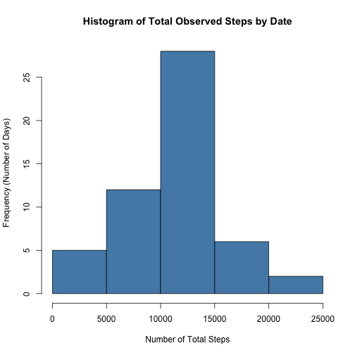
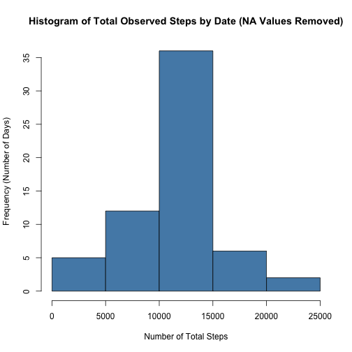
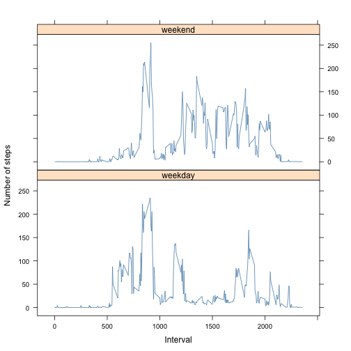

# Reproducible Research: Peer Assessment 1

This report was created to fulfill Course Project 1 in the 'Reproducible Research' course in the Data Science Signature Track for Coursera.

It was completed on 5/12/2014.

tim@timmarco.com


## Dependencies
This script requires the lattice package for outputting graphics.


```r

library(lattice)

```


## Loading and preprocessing the data

The data for this report come from personal monitoring devices, and reports on the number of steps taken by users over 5-minute intervals. They are recorded in the 'activity.csv' file.


```r

raw.data <- read.csv("activity.csv")
```


## What is mean total number of steps taken per day?

First, we calculate the **total** number of steps for every date in the raw data set. A histogram of these results can be seen below:


```r
total.steps <- aggregate(raw.data$step ~ raw.data$date, data = raw.data, sum, 
    na.rm = TRUE)


hist(total.steps[, 2], xlab = "Number of Total Steps", ylab = "Frequency (Number of Days)", 
    main = "Histogram of Total Observed Steps by Date", col = "#548BB5")
```

 


Next, we calculate the **mean** and **median** number of steps on a given date. Values by date are shown below:


### Mean


```r
mean.steps.per.day <- mean(total.steps[, 2])
mean.steps.per.day
```

```
## [1] 10766
```


### Median


```r
median.steps.per.day <- median(total.steps[, 2])
median.steps.per.day
```

```
## [1] 10765
```


The mean value for number of steps per day is **10,766**. The median value is very close: **10,765**. This data set appears to be quite normally distributed.

## What is the average daily activity pattern?

In this step, we will calculate the **average number of steps** taken, aggregated by the five-minute intervals in the original data set. The line chart below plots these values.

*Note: 'average' here is interpreted to mean the 'mean' value, not the median.*


```r

average.steps.by.interval <- aggregate(raw.data$step ~ raw.data$interval, data = raw.data, 
    mean, na.rm = FALSE)
names(average.steps.by.interval) <- c("interval", "steps")
plot(average.steps.by.interval, type = "l", xlab = "Five-Minute Interval", ylab = "Average Number of Steps", 
    main = "Average number of Steps by Five Minute Interval", col = "#548BB5")
```

 

```r

```


Next, we get the **interval with the highest average steps**. This is stored as *max.interval*.


```r

max.interval <- average.steps.by.interval[average.steps.by.interval$steps == 
    max(average.steps.by.interval$steps), 1]
max.interval
```

```
## [1] 835
```


The interval with the highest average number of steps is **835**.


## Imputing missing values

First, we count the **number of NA values in the data set**. This value is stored as *count.raw*.


```r

count.raw <- sum(is.na(raw.data))
count.raw
```

```
## [1] 2304
```


### Strategy for replacing 'NA' values

NA values from the original dataset are replaced by the average for the corresponding interval. These values are taken from the *average.steps.by.interval* data.frame. These are stored as *cleaned.data* 


```r

replace.nas <- function(row) {
    if (is.na(row[1])) {
        current.interval <- as.numeric(row[3])
        new.value <- average.steps.by.interval[average.steps.by.interval$interval == 
            current.interval, ]
        new.value <- new.value[2]
    } else {
        new.value <- row[1]
    }
    
    
    as.numeric(new.value[1])
}


cleaned.data <- raw.data

cleaned.data$steps <- apply(cleaned.data, 1, replace.nas)

```


### Histogram (NAs removed)


```r

total.steps.cleaned <- aggregate(cleaned.data$step ~ cleaned.data$date, data = cleaned.data, 
    sum)

hist(total.steps.cleaned[, 2], xlab = "Number of Total Steps", ylab = "Frequency (Number of Days)", 
    main = "Histogram of Total Observed Steps by Date (NA Values Removed)", 
    col = "#548BB5")
```

 

```r

```


### Mean (NAs removed)


```r
mean.steps.per.day.cleaned <- mean(total.steps.cleaned[, 2])
mean.steps.per.day.cleaned
```

```
## [1] 10766
```


### Median (NAs removed)


```r
median.steps.per.day <- median(total.steps[, 2])
median.steps.per.day
```

```
## [1] 10765
```


## Are there differences in activity patterns between weekdays and weekends?


```r

cleaned.data$date <- as.Date(cleaned.data$date)

day.of.week.test <- weekdays(cleaned.data$date)

days <- c("Monday", "Tuesday", "Wednesday", "Thursday", "Friday", "Saturday", 
    "Sunday")
d.labels <- c("weekday", "weekday", "weekday", "weekday", "weekday", "weekend", 
    "weekend")
cleaned.data$daytype <- factor(day.of.week.test, levels = days, labels = d.labels)
```

```
## Warning: duplicated levels in factors are deprecated
```

```r


cleaned.averages.by.interval <- aggregate(as.numeric(cleaned.data$step) ~ as.numeric(cleaned.data$interval) + 
    cleaned.data$daytype, data = cleaned.data, mean, na.rm = FALSE)

cleaned.data.split <- split(cleaned.data, cleaned.data$daytype)

weekday.data <- cleaned.data.split$weekday
weekend.data <- cleaned.data.split$weekend

weekday.average.steps.by.interval <- aggregate(as.numeric(weekday.data$step) ~ 
    as.numeric(weekday.data$interval), data = weekday.data, mean, na.rm = FALSE)

weekend.average.steps.by.interval <- aggregate(as.numeric(weekend.data$step) ~ 
    as.numeric(weekend.data$interval), data = weekend.data, mean, na.rm = FALSE)

names(weekday.average.steps.by.interval) <- c("interval", "steps")
names(weekend.average.steps.by.interval) <- c("interval", "steps")


weekday.average.steps.by.interval$day <- "weekday"
weekend.average.steps.by.interval$day <- "weekend"

combine.back <- data.frame
combine.back <- rbind(weekday.average.steps.by.interval, weekend.average.steps.by.interval)

xyplot(steps ~ interval | day, data = combine.back, type = "l", horizontal = TRUE, 
    layout = c(1, 2), ylab = "Number of steps", xlab = "Interval", col = "#548BB5")
```

 

```r

```


